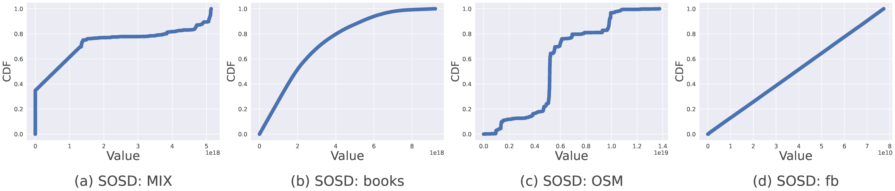

## SOSD data for evaluation

We utilize the State Of the Sorting Database (SOSD) benchmark suite for rigorous evaluation of LITune against learned index structures. This benchmark encompasses datasets with up to 200 million 64-bit unsigned integer keys across various domains: 
- **(a) Amazon data (books)**: Popularity data of book sales.
- **(b) OpenStreetMap data (OSM)**: Identifiers for geographical entities.
- **(c) Facebook data (fb)**: Upsampled dataset of Facebook user IDs.
- **(d) MIX data (MIX)**: A blend of uniform, FB, books, and OSM distributions.

## Workload Details

**Static Workload:**  
In static scenarios, our evaluation dataset consists of 90M records, sampled from a larger 100M dataset. Within this 90M, we allocate 10M records to establish a fixed underlying data distribution, while the remaining 80M are used for updates, specifically for INSERT and DELETE operations. We examine three types of queries: Balanced (B), Read-Heavy (RH), and Write-Heavy (WH). These are characterized by their Write-Read Ratio (W/R Ratio).

**Data-shifting Workload:**  
Evaluations with shifting data adhere to the tumbling window strategy, partitioning the 100M evaluation dataset into 30 distinct data chunks. This technique prompts LITune to frequently adjust its optimization parameters. Due to evaluation cost considerations, we use a scaled-down dataset for this case. Each time window consists of 1M records serving as the underlying data, along with 8M records used for updates (INSERT and DELETE). We maintain the same query types as in the static case.

#### Workload Details Table
| Query Type  | Updates (Static) | Searches (Static) | W/R (Static) | Updates (Data-shifting) | Searches (Data-shifting) | W/R (Data-shifting) |
|-------------|------------------|-------------------|--------------|-------------------------|--------------------------|----------------------|
| Balanced (B) | 160M | 160M | 1 | 16M | 16M | 1 |
| Read-Heavy (RH) | 80M | 240M | 1:3 | 8M | 24M | 1:3 |
| Write-Heavy (WH) | 120M | 40M | 3:1 | 12M | 4M | 3:1 |

### E2E Performance When Limiting the Tuning Budgets

We conducted an analysis on the tuning performance when varying the tuning time budgets, which reflects the considerations for tuning time during online use. Initially, a "Limited Time Budget" examination was carried out, where the tuning process was allotted a timeframe between 50s and 250s. This timeframe is designed to simulate environments where swift decision-making and system adaptability are crucial.

The rationale behind setting this range of tuning budgets is to approximate from 1/5 to the full runtime of ALEX and CARMI for balanced queries with default settings in our tests. This setup is intended to accommodate an evaluation of performance and adaptability amid diverse time-sensitive use-cases. Although specifying tuning steps could be an alternative, the variability in step-wise time requirements across different methods and the real-world user preference for a temporal budget (set in seconds) over a step-wise budget necessitate this approach.

Despite the very limited tuning budgets, LITune still outperforms other tuning methods.

#### Figure: Runtime Performance with Limited Tuning Budget (ALEX)

#### Figure: Runtime Performance with Limited Tuning Budget (CARMI)

